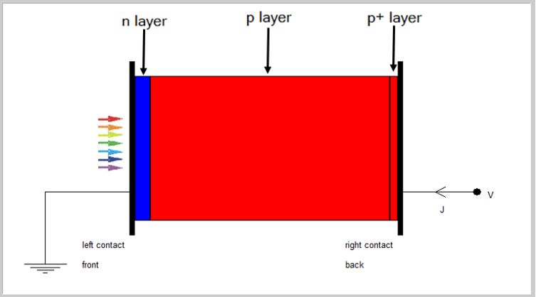
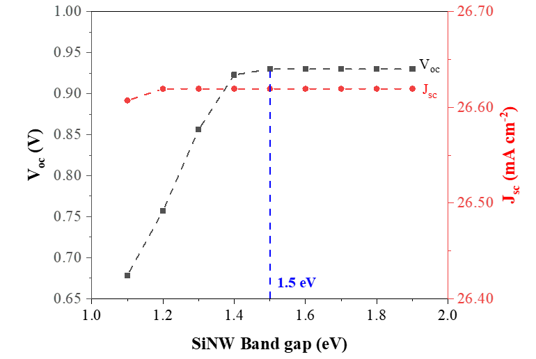
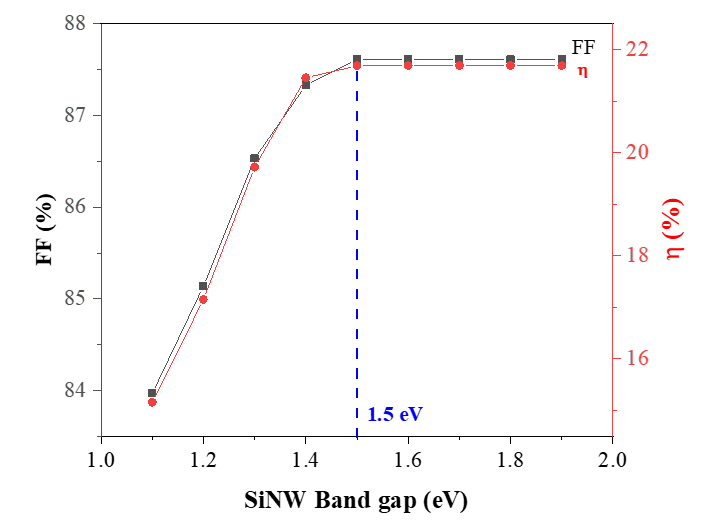
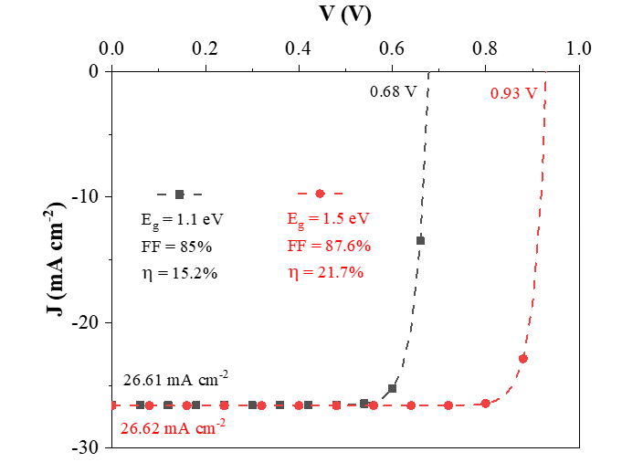
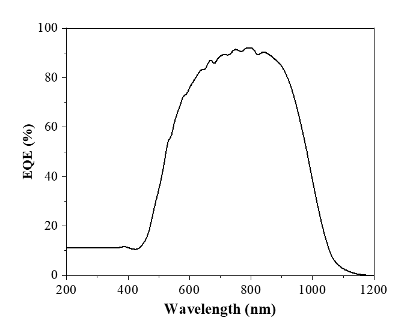

# Interpretation of Band Gap Tuning for Silicon Nanowire (SiNW) Solar Cell  
**Author:** Maharathi Karan (122EE0151)  
**Guide:** Prof. Paresh G. Kale  
**Department of Electrical Engineering, NIT Rourkela**

---

## 📌 Project Overview
Silicon nanowire (SiNW) solar cells exhibit enhanced optical absorption and improved charge collection due to their geometry. However, their large surface-to-volume ratio introduces recombination issues.

This project investigates **bandgap tuning of the SiNW emitter layer (1.1–1.9 eV)** and analyzes its effect on performance parameters such as:
- Open-circuit voltage (Voc)  
- Short-circuit current density (Jsc)  
- Fill Factor (FF)  
- Efficiency (η)  
- EQE spectrum  

Simulations were performed using **SCAPS-1D v3.3.11**.

---

## 📘 Device Structure

The SiNW solar cell model consists of:

- **n-layer (SiNW emitter)** – bandgap varied  
- **p-layer (Si absorber)**  
- **p+ BSF layer**  

### Structure Diagram  

---

## 🧪 Simulation Setup  
SCAPS-1D solves Poisson and continuity equations to extract I–V, EQE, Voc, Jsc, FF, and η.

Material parameters include:
- Doping concentrations  
- Bandgaps  
- Mobilities  
- Radiative and Auger recombination coefficients  

A detailed parameter table is included in the project report.

---

## 📊 Results & Discussion  

### **1️⃣ Voc and Jsc vs Bandgap**  
This graph shows:
- **Voc increases significantly** as the bandgap increases and saturates around **1.5 eV**  
- **Jsc remains nearly constant** (~26.6 mA/cm²) because of strong optical absorption in nanowires  

---

### **2️⃣ Fill Factor and Efficiency vs Bandgap**  
This graph shows:
- FF improves sharply up to **1.5 eV**, after which it saturates  
- Maximum FF = **87.6%**  
- Maximum efficiency = **21.7%**  

---

### **3️⃣ J–V Characteristics for Different Bandgaps**  
Comparison shows:
- **Eg = 1.1 eV:** Voc = 0.68 V, FF = 85%, η = 15.2%  
- **Eg = 1.5 eV:** Voc = 0.93 V, FF = 87.6%, η = 21.7%  

The right shift of the J–V curve with higher bandgap confirms improved junction quality.

---

### **4️⃣ EQE Spectrum for Eg = 1.5 eV**  
Key observations:
- Low EQE in UV region (<450 nm) due to surface recombination  
- High EQE (>80%) between 600–900 nm  
- Indicates strong photocarrier generation and collection  

---

## 🧾 Conclusion  
Bandgap tuning of SiNW emitters significantly enhances photovoltaic performance.  
The optimal configuration is found at **Eg ≈ 1.5 eV**, where:
- Voc is maximized  
- FF improves  
- Efficiency reaches **21.7%**  

This establishes **bandgap engineering** as a key method for improving Si nanowire solar cell performance.

---

